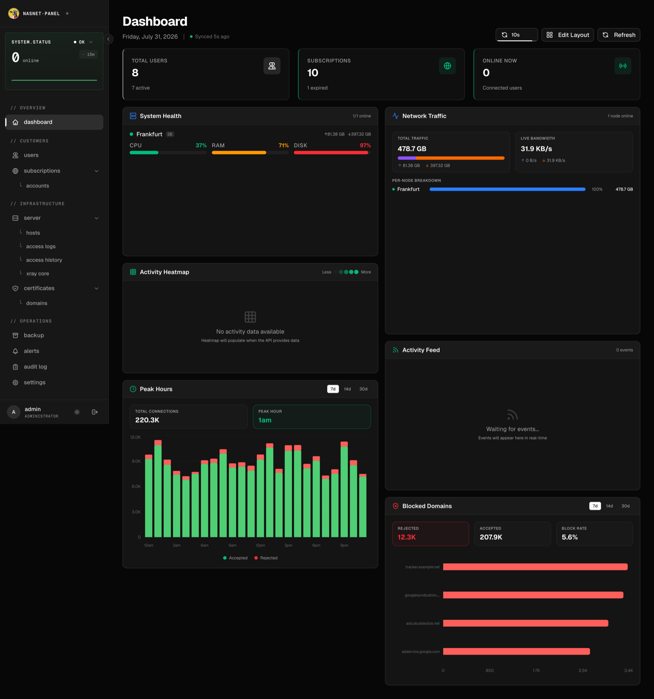
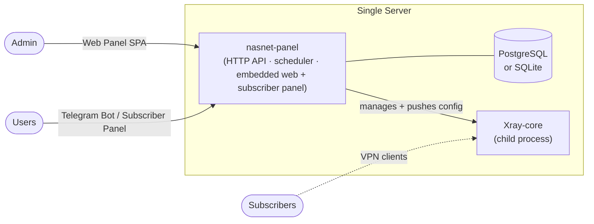

<div align="center">

# پنل NasNet (nasnet-panel)

**یک پنل کنترل خودمیزبان برای اجرا و مدیریت اشتراک‌های VPN مبتنی بر Xray روی یک سرور واحد.**

یک باینری. پنل وب مدیریت را اجرا می‌کند، یک پردازهٔ محلی Xray-core را مدیریت می‌کند، لینک‌های اشتراک جهانی سرو می‌کند و یک بات تلگرام اختیاری را می‌گرداند — همه از یک باینری واحد Go.

[](./LICENSE)
[](https://go.dev)
[](./docker-compose.yml)
[](https://github.com/nasnet-community/nasnet-panel-linux/releases)
[](./docs/development.md)

[🇬🇧 English](./README.md) · **🇮🇷 فارسی**

[شروع سریع](#-شروع-سریع) · [امکانات](#-امکانات) · [معماری](#-معماری) · [مستندات](#-مستندات)

</div>

---

> [!NOTE]
> **جای اسکرین‌شات.** یک اسکرین‌شات از پنل را در مسیر `docs/assets/panel-dashboard.png` قرار دهید تا اینجا نمایش داده شود.
>
> <!--  -->

<div dir="rtl" align="right">

## این چیست؟

**پنل NasNet** (باینری `nasnet-panel`) یک پلتفرم مدیریت پروکسی تک‌سروری است. یک باینری تمام وضعیت را نگه می‌دارد — کاربران، اشتراک‌ها و پیکربندی سرور — و یک پردازهٔ محلی **Xray-core** را که به‌عنوان پردازهٔ فرزندِ تحت‌نظارت روی همان میزبان اجرا می‌شود، مدیریت می‌کند. لینک‌های اشتراک جهانی می‌سازد، یک پنل وب مدیریت و یک پنل سلف‌سرویس برای مشترک ارائه می‌دهد و می‌تواند یک بات تلگرام اختیاری را بگرداند.

این پروژه برای اپراتورهایی ساخته شده که یک سرور پروکسی اجرا می‌کنند و یک جای واحد می‌خواهند تا:

- اینباوند، اوت‌باوند و مسیریابی را بدون ویرایش دستی پیکربندی Xray تنظیم کنند،
- اشتراک‌های محدود به زمان و ترافیک صادر کنند،
- به کاربران نهایی از طریق پنل مشترک یا تلگرام یک تجربهٔ سلف‌سرویس بدهند،
- و ترافیک، سلامت و منابع سیستم را زیر نظر داشته باشند.

همه‌چیز در یک **باینری واحد** با پنل وب مدیریت و پنل مشترکِ جاسازی‌شده عرضه می‌شود — به‌علاوهٔ PostgreSQL و Xray-core بسته‌بندی‌شدهٔ اختیاری برای نصب آفلاین.

## ✨ امکانات

**مدیریت پروکسی (Xray-core محلی)**
- 🔌 **پروتکل‌ها** — VMess، VLESS، Trojan، Shadowsocks با ترانسپورت‌های TLS / **REALITY** / XTLS، به‌علاوهٔ پیرهای مدیریت‌شدهٔ **WireGuard**.
- 🧭 **مسیریابی و توزیع بار** — اینباوند، اوت‌باوند، قوانین مسیریابی و قوانین توزیع بار، با تطبیق مبتنی بر جغرافیا (geoip/geosite).
- 🩺 **Xray-core تحت‌نظارت** — Xray به‌عنوان پردازهٔ فرزندِ مدیریت‌شده با نگهبانِ راه‌اندازی مجدد خودکار و مدیریت نسخه در پنل (دانلود / تعویض / به‌روزرسانی) اجرا می‌شود.
- 🖥️ **عملیات سرور** — ترمینال وب زنده، مدیریت SSH، لاگ‌های دسترسی، حسابداری ترافیک، مدیریت فایل‌های جغرافیایی، آمار سیستم میزبان و یک قابلیت پاک‌سازی کامل (nuke/wipe) با محافظ.

**اشتراک‌ها و کاربران**
- 🔗 **اشتراک‌های جهانی** — یک لینک اشتراک base64 واحد که کلاینت (v2rayNG، v2rayN، Clash، sing-box، Shadowrocket) را تشخیص می‌دهد و پیکربندی و متادیتای درست را سرو می‌کند.
- ⏱️ **حساب‌های محدود به زمان و ترافیک** — اشتراک‌های به‌ازای هر کاربر با انقضا و سقف مصرف داده.
- 📲 **پنل مشترک** — یک صفحهٔ سلف‌سرویس در `/sub/{key}`: آمار مصرف زنده، کدهای QR، ایمپورت تک‌ضربه‌ای به اپ‌های کلاینت، دستگاه‌های WireGuard و گفت‌وگوی اختیاری با مدیر.

**رابط‌ها**
- 🖥️ **پنل وب مدیریت** — یک React SPA جاسازی‌شده در باینری (داشبورد، سرور، کاربران، اشتراک‌ها، تنظیمات، ترمینال زنده، نمودارها).
- 🤖 **بات تلگرام** — عملیات مدیریتی به‌علاوهٔ اطلاعات حساب و اشتراک برای کاربران.

**عملیات**
- 📊 **متریک و هشدار** — متریک‌های درجه‌یک Prometheus و یک موتور هشدار مبتنی بر قانونِ داخلی.
- 📨 **اعلان‌ها** — کانال‌های تلگرام، Discord و وب‌هوک عمومی.
- 🪵 **لاگ ممیزی و چت پشتیبانی** — هر اقدام مدیریتی ثبت می‌شود؛ کاربران و مدیران می‌توانند درون‌برنامه‌ای چت کنند (اختیاری، به‌طور پیش‌فرض خاموش).
- 💾 **پشتیبان‌گیری و بازیابی** برای هر دو PostgreSQL و SQLite.
- 🔒 **TLS خودکار** از طریق ACME (Let's Encrypt)، یا استفاده از گواهی خودتان.

## 🏗️ معماری



- **`nasnet-panel`** — کل برنامه در یک باینری: HTTP API، پنل وب + پنل مشترکِ جاسازی‌شده، بات تلگرام، زمان‌بندِ پس‌زمینه و تنها منبع حقیقت (Postgres یا SQLite). پردازهٔ محلی Xray-core را نظارت می‌کند و پیکربندی تولیدشده را درون‌پردازه‌ای به آن می‌فرستد.
- **Xray-core** — هستهٔ پروکسی، که به‌عنوان پردازهٔ فرزندِ تحت‌نظارت روی همان میزبان اجرا می‌شود.
- **`nasnet-tool.sh`** — یک TUI نصب/عملیات تعاملی (نصب، پیکربندی مجدد، به‌روزرسانی، پشتیبان‌گیری) برای استقرارهای Docker یا systemd.

پایگاه کد از یک معماری لایه‌ای و تمیز پیروی می‌کند (`domain` → `usecase` → `repository` → `delivery`) به‌ازای هر ویژگی. مراجعه کنید به [docs/architecture.md](./docs/architecture.md).

## 🚀 شروع سریع

> 🧭 **تازه‌کارید؟** راهنمای ساده و گام‌به‌گام [شروع به کار](./docs/getting-started.fa.md) ([English](./docs/getting-started.md)) را دنبال کنید — کل نصب را قدم‌به‌قدم پیش می‌برد.

> نیازمند یک سرور Linux با **Docker** + **Docker Compose**. پورت پیش‌فرض پنل **`9761`** است.

```bash
# ۱. کلون
git clone https://github.com/nasnet-community/nasnet-panel-linux.git
cd nasnet-panel-linux

# ۲. ساخت پیکربندی
cp .env.example .env

# ۳. تنظیم موارد ضروری در .env:
#    - ADMIN_USERNAME / ADMIN_PASSWORD_HASH  (هش را بسازید، پایین را ببینید)
#    - JWT_SECRET_KEY                         (openssl rand -hex 32)
#    - APP_BASE_URL                           (https://your-domain یا http://your-ip:9761)
#
#    ساخت هش رمز عبور:
#    htpasswd -nbBC 10 "" "your-password" | tr -d ':\n' | sed 's/$2y/$2a/'

# ۴. راه‌اندازی (PostgreSQL + app + Prometheus)
docker compose up -d

# ۵. باز کردن پنل
#    http://your-ip:9761
```

به‌جای PostgreSQL، SQLite را ترجیح می‌دهید؟ در `.env` مقدار `DB_DRIVER=sqlite` را تنظیم کنید و با فایل override راه‌اندازی کنید:

```bash
docker compose -f docker-compose.yml -f docker-compose.sqlite.yml up -d
```

**سایر مسیرهای نصب** — نصب‌کنندهٔ راهنما (`nasnet-tool.sh`)، systemd، باینری‌های آمادهٔ ریلیز و بستهٔ آفلاین (شامل PostgreSQL + Xray) همگی در **[docs/installation.md](./docs/installation.md)** پوشش داده شده‌اند.

## 🧩 رابط‌ها

| رابط | برای چه کسی | توضیحات |
|------|-------------|---------|
| **پنل وب** | مدیران | SPA جاسازی‌شده که در `APP_BASE_URL` سرو می‌شود. مدیریت کامل + نمودارهای زنده و ترمینال سرور. |
| **پنل مشترک** | کاربران | صفحهٔ سلف‌سرویس در `/sub/{key}` — مصرف، کدهای QR، ایمپورت کلاینت، دستگاه‌های WireGuard، چت پشتیبانی اختیاری. |
| **بات تلگرام** | مدیران و کاربران | اختیاری. `TELEGRAM_ENABLED=true` + یک توکن از `@BotFather` تنظیم کنید. Polling یا webhook. |
| **لینک اشتراک** | هر کلاینت VPN | `/sub/{key}` — فید base64 جهانی با تشخیص خودکار کلاینت. |

## ⚙️ پیکربندی

تمام پیکربندی مبتنی بر متغیر محیطی است (از `.env` بارگذاری می‌شود). مهم‌ترین کلیدها عبارت‌اند از اعتبارنامهٔ مدیر، `JWT_SECRET_KEY`، `APP_BASE_URL` و درایور پایگاه داده. مرجع کامل و حاشیه‌نویسی‌شده در **[docs/configuration.md](./docs/configuration.md)** و در [`.env.example`](./.env.example) قرار دارد.

## 📚 مستندات

| راهنما | داخلش چیست |
|--------|------------|
| [شروع به کار](./docs/getting-started.fa.md) | **از اینجا شروع کنید** — نصب سادهٔ گام‌به‌گام برای کاربران تازه‌کار |
| [نصب](./docs/installation.md) | Docker، systemd، ویزارد `nasnet-tool`، باینری‌های ریلیز، بستهٔ آفلاین، ساخت از سورس |
| [پیکربندی](./docs/configuration.md) | هر متغیر `.env`، مقادیر پیش‌فرض و کارکردش |
| [معماری](./docs/architecture.md) | طراحی تک‌باینری، لایه‌بندی، گذرگاه رویداد، پایگاه داده |
| [سرور و Xray](./docs/nodes-and-agents.md) | مدیریت سرور محلی، پردازهٔ Xray-core و به‌روزرسانی نسخه |
| [پروتکل‌ها و مسیریابی](./docs/protocols-and-routing.md) | اینباوند، اوت‌باوند، REALITY، WireGuard، قوانین مسیریابی و توزیع بار |
| [اشتراک‌ها و کلاینت‌ها](./docs/subscriptions-and-clients.md) | لینک‌های اشتراک، فرمت‌ها، اپ‌های کلاینت پشتیبانی‌شده |
| [بات تلگرام](./docs/telegram.md) | راه‌اندازی بات، webhook در برابر polling |
| [پنل مدیریت](./docs/admin-panel.md) | یک تور از پنل وب |
| [TLS، ACME و دامنه‌ها](./docs/tls-acme-and-domains.md) | گواهی‌های خودکار و دستی، پروکسی‌های معکوس |
| [نظارت و هشدار](./docs/monitoring-and-alerting.md) | متریک‌های Prometheus، قوانین هشدار، اعلان‌ها |
| [پشتیبان‌گیری و بازیابی](./docs/backup-and-restore.md) | پشتیبان‌گیری و بازیابی پایگاه داده |
| [توسعه](./docs/development.md) | چیدمان پروژه، ساخت، فرانت‌اندها، protobuf، تست‌ها |
| [عیب‌یابی و پرسش‌های متداول](./docs/troubleshooting-and-faq.md) | مشکلات رایج و پاسخ‌ها |

## 🛠️ پشتهٔ فناوری

**بک‌اند** Go 1.26 · [Gin](https://github.com/gin-gonic/gin) · [GORM](https://gorm.io) (PostgreSQL / SQLite) · [Cobra](https://github.com/spf13/cobra) · [Xray-core](https://github.com/XTLS/Xray-core) · [Prometheus client](https://github.com/prometheus/client_golang) · [telebot](https://github.com/tucnak/telebot)
**فرانت‌اند** React 19 · Vite · TypeScript · Tailwind · Radix UI
**زیرساخت** Docker / Docker Compose · systemd · ACME (Let's Encrypt)

## 🤝 مشارکت

از مشارکت استقبال می‌شود. با [راهنمای توسعه](./docs/development.md) برای چیدمان پروژه، دستورالعمل‌های ساخت و نحوهٔ اجرای مجموعهٔ تست شروع کنید. لطفاً پیش از ارسال PR برای تغییرات قابل‌توجه، یک issue برای بحث باز کنید.

## 📄 مجوز

تحت **GNU Affero General Public License v3.0** منتشر شده است. [LICENSE](./LICENSE) را ببینید.

به‌طور خلاصه: می‌توانید این نرم‌افزار را استفاده، تغییر و بازتوزیع کنید، اما اگر نسخهٔ تغییریافته را به‌عنوان یک سرویس شبکه‌ای اجرا کنید، باید سورس خود را در اختیار کاربرانش قرار دهید.

</div>
