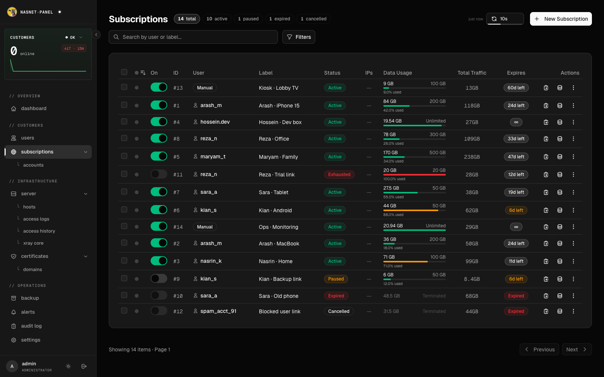
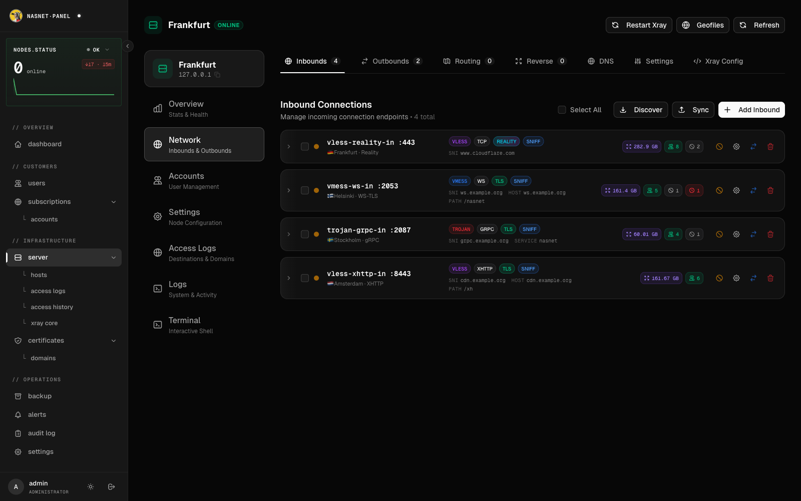
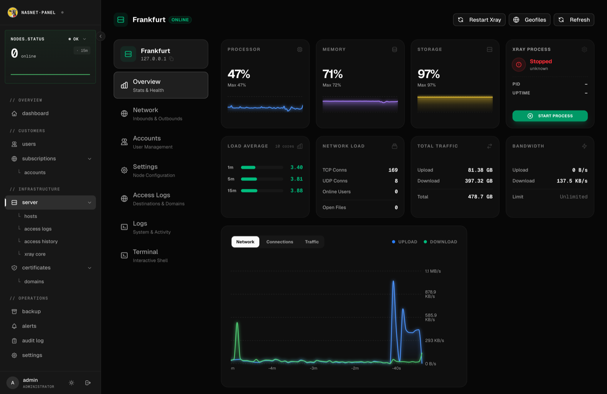
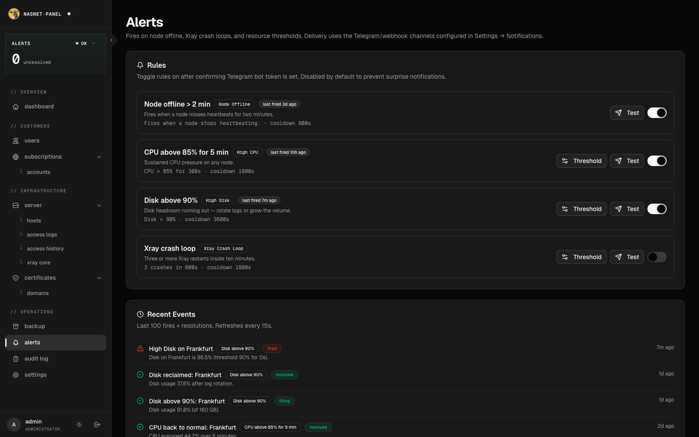
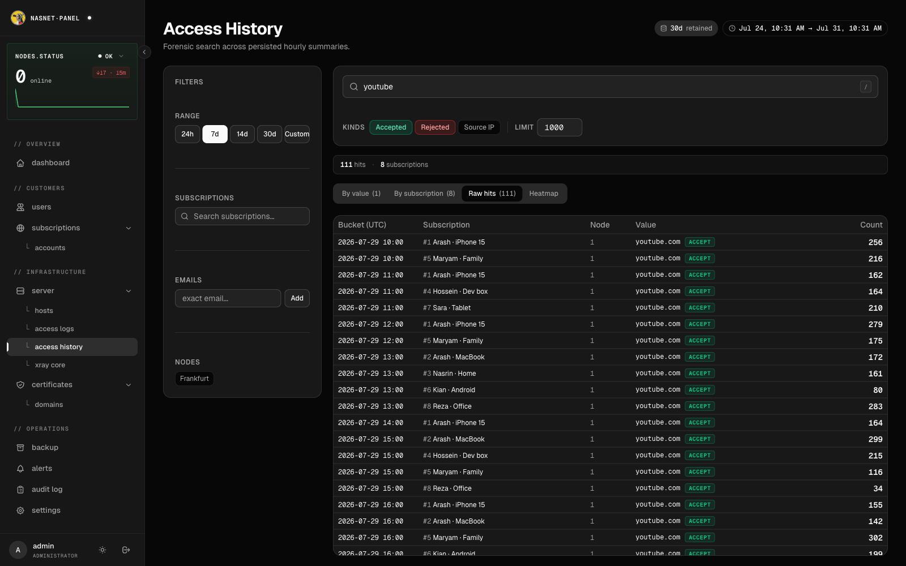
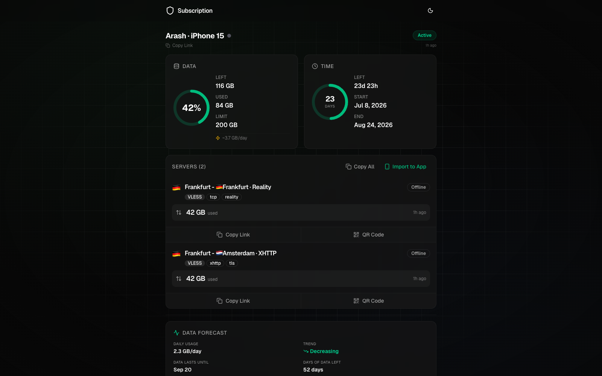
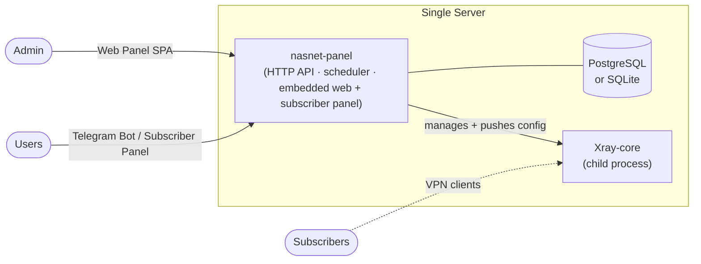

<div align="center">

# NasNet Panel (nasnet-panel)

**A self-hosted control panel for running and managing Xray VPN subscriptions on a single server.**

One binary. It runs the admin web panel, manages a local Xray-core process, serves universal subscription links, and drives an optional Telegram bot — all from a single Go binary.

[](./LICENSE)
[](https://go.dev)
[](./docker-compose.yml)
[](https://github.com/nasnet-community/nasnet-panel-linux/releases)
[](./docs/development.md)

**🇬🇧 English** · [🇮🇷 فارسی](./README.fa.md)

[Quickstart](#-quickstart) · [Features](#-features) · [Architecture](#-architecture) · [Documentation](#-documentation)

</div>

---


<details>
<summary><b>More screenshots</b> — subscriptions, inbounds, server, alerts, subscriber panel</summary>

| | |
|---|---|
| **Subscriptions** — status, quota, expiry at a glance<br> | **Inbounds** — protocols, transports, per-inbound traffic<br> |
| **Server** — live CPU/RAM/disk, traffic, Xray process<br> | **Alerts** — rules and fired/resolved events<br> |
| **Access history** — searchable per-subscription domain log<br> | **Subscriber panel** — the self-serve page at `/sub/{key}`<br> |

</details>

## What is it?

**NasNet Panel** (the `nasnet-panel` binary) is a single-server proxy management platform. One binary holds all state — users, subscriptions, and server configuration — and manages a local **Xray-core** process running as a supervised child process on the same host. It generates universal subscription links, exposes an admin web panel and a subscriber self-serve panel, and can drive an optional Telegram bot.

It is built for operators who run a proxy server and want one place to:

- configure inbounds, outbounds, and routing without hand-editing Xray config,
- hand out time- and traffic-limited subscriptions,
- give end users a self-serve experience through the subscriber panel or Telegram,
- and keep an eye on traffic, health, and system resources.

Everything ships in a **single binary** with the admin web panel and subscriber panel embedded — plus an optional bundled PostgreSQL and Xray-core for offline installs.

## ✨ Features

**Proxy management (local Xray-core)**
- 🔌 **Protocols** — VMess, VLESS, Trojan, Shadowsocks with TLS / **REALITY** / XTLS transports, plus **WireGuard** managed peers.
- 🧭 **Routing & balancing** — inbounds, outbounds, routing rules, and load-balancing rules, with geo-based (geoip/geosite) matching.
- 🩺 **Supervised Xray-core** — Xray runs as a managed child process with an auto-restart watchdog and in-panel version management (download / switch / update).
- 🖥️ **Server operations** — live web terminal, SSH management, access logs, traffic accounting, geofile management, host system stats, and a gated nuke/wipe.

**Subscriptions & users**
- 🔗 **Universal subscriptions** — a single base64 subscription link that auto-detects the client (v2rayNG, v2rayN, Clash, sing-box, Shadowrocket) and serves the right config and metadata.
- ⏱️ **Time- and traffic-limited accounts** — per-user subscriptions with expiry and data caps.
- 📲 **Subscriber panel** — a self-serve page at `/sub/{key}`: live usage stats, QR codes, one-tap import to client apps, WireGuard devices, and optional chat with the admin.

**Interfaces**
- 🖥️ **Admin web panel** — a React SPA embedded in the binary (dashboard, server, users, subscriptions, settings, live terminal, charts).
- 🤖 **Telegram bot** — admin operations plus user-facing account and subscription info.

**Operations**
- 📊 **Metrics & alerting** — first-class Prometheus metrics and a built-in rule-based alert engine.
- 📨 **Notifications** — Telegram, Discord, and generic webhook channels.
- 🪵 **Audit log & support chat** — every admin action is recorded; users and admins can chat in-app (optional, off by default).
- 💾 **Backup & restore** for both PostgreSQL and SQLite.
- 🔒 **Automatic TLS** via ACME (Let's Encrypt), or bring your own certificate.

## 🏗️ Architecture



- **`nasnet-panel`** — the whole application in one binary: HTTP API, embedded web panel + subscriber panel, Telegram bot, background scheduler, and the single source of truth (Postgres or SQLite). It supervises the local Xray-core process and pushes generated configuration to it in-process.
- **Xray-core** — the proxy core, run as a supervised child process on the same host.
- **`nasnet-tool.sh`** — an interactive installer/operations TUI (install, reconfigure, update, backup) for Docker or systemd deployments.

The codebase follows a clean, layered architecture (`domain` → `usecase` → `repository` → `delivery`) per feature. See [docs/architecture.md](./docs/architecture.md).

## 🚀 Quickstart

> 🧭 **New here?** Follow the simple step-by-step [Getting Started guide](./docs/getting-started.md) ([فارسی](./docs/getting-started.fa.md)) — it walks you through the whole install.

**One-liner install** (Debian/Ubuntu) — downloads the interactive installer; no clone, no toolchains. It walks you through everything and installs verified release binaries:

```bash
curl -fsSL https://raw.githubusercontent.com/nasnet-community/nasnet-panel-linux/main/nasnet-tool.sh -o nasnet-tool.sh && bash nasnet-tool.sh
```

### Docker (manual)

> Requires a Linux server with **Docker** + **Docker Compose**. Default panel port is **`9761`**.

```bash
# 1. Clone
git clone https://github.com/nasnet-community/nasnet-panel-linux.git
cd nasnet-panel-linux

# 2. Create your config
cp .env.example .env

# 3. Set the essentials in .env:
#    - ADMIN_USERNAME / ADMIN_PASSWORD_HASH  (generate the hash, see below)
#    - JWT_SECRET_KEY                         (openssl rand -hex 32)
#    - APP_BASE_URL                           (https://your-domain or http://your-ip:9761)
#
#    Generate the password hash:
#    htpasswd -nbBC 10 "" "your-password" | tr -d ':\n' | sed 's/$2y/$2a/'

# 4. Launch (PostgreSQL + app + Prometheus)
docker compose up -d

# 5. Open the panel
#    http://your-ip:9761
```

Prefer SQLite instead of PostgreSQL? Set `DB_DRIVER=sqlite` in `.env` and start with the override file:

```bash
docker compose -f docker-compose.yml -f docker-compose.sqlite.yml up -d
```

**Other install paths** — guided installer (`nasnet-tool.sh`), systemd, prebuilt release binaries, and the offline bundle (with PostgreSQL + Xray included) are all covered in **[docs/installation.md](./docs/installation.md)**.

## 🧩 Interfaces

| Interface | Who it's for | Notes |
|-----------|--------------|-------|
| **Web panel** | Admins | Embedded SPA served at `APP_BASE_URL`. Full management + live charts and server terminal. |
| **Subscriber panel** | Users | Self-serve page at `/sub/{key}` — usage, QR codes, client import, WireGuard devices, optional support chat. |
| **Telegram bot** | Admins & users | Optional. Set `TELEGRAM_ENABLED=true` + a `@BotFather` token. Polling or webhook. |
| **Subscription link** | Any VPN client | `/sub/{key}` — universal base64 feed with client auto-detection. |

## ⚙️ Configuration

All configuration is environment-variable based (loaded from `.env`). The most important keys are the admin credentials, `JWT_SECRET_KEY`, `APP_BASE_URL`, and the database driver. The full annotated reference lives in **[docs/configuration.md](./docs/configuration.md)** and in [`.env.example`](./.env.example).

## 📚 Documentation

| Guide | What's inside |
|-------|---------------|
| [Getting Started](./docs/getting-started.md) | **Start here** — simple step-by-step install for first-time users |
| [Installation](./docs/installation.md) | Docker, systemd, the `nasnet-tool` wizard, release binaries, offline bundle, build from source |
| [Configuration](./docs/configuration.md) | Every `.env` variable, defaults, and what it does |
| [Architecture](./docs/architecture.md) | Single-binary design, layering, event bus, database |
| [Server & Xray](./docs/nodes-and-agents.md) | Managing the local server, Xray-core process, and version updates |
| [Protocols & Routing](./docs/protocols-and-routing.md) | Inbounds, outbounds, REALITY, WireGuard, routing & balancing rules |
| [Subscriptions & Clients](./docs/subscriptions-and-clients.md) | Subscription links, formats, supported client apps |
| [Telegram Bot](./docs/telegram.md) | Bot setup, webhook vs polling |
| [Admin Panel](./docs/admin-panel.md) | A tour of the web panel |
| [TLS, ACME & Domains](./docs/tls-acme-and-domains.md) | Automatic and manual certificates, reverse proxies |
| [Monitoring & Alerting](./docs/monitoring-and-alerting.md) | Prometheus metrics, alert rules, notifications |
| [Backup & Restore](./docs/backup-and-restore.md) | Database backups and restore |
| [Development](./docs/development.md) | Project layout, building, frontends, protobuf, tests |
| [Troubleshooting & FAQ](./docs/troubleshooting-and-faq.md) | Common problems and answers |

## 🛠️ Tech stack

**Backend** Go 1.26 · [Gin](https://github.com/gin-gonic/gin) · [GORM](https://gorm.io) (PostgreSQL / SQLite) · [Cobra](https://github.com/spf13/cobra) · [Xray-core](https://github.com/XTLS/Xray-core) · [Prometheus client](https://github.com/prometheus/client_golang) · [telebot](https://github.com/tucnak/telebot)
**Frontend** React 19 · Vite · TypeScript · Tailwind · Radix UI
**Infra** Docker / Docker Compose · systemd · ACME (Let's Encrypt)

## 🤝 Contributing

Contributions are welcome. Start with the [development guide](./docs/development.md) for project layout, build instructions, and how to run the test suite. Please open an issue to discuss substantial changes before sending a PR.

## 📄 License

Licensed under the **GNU Affero General Public License v3.0**. See [LICENSE](./LICENSE).

In short: you may use, modify, and redistribute this software, but if you run a modified version as a network service, you must make your source available to its users.
