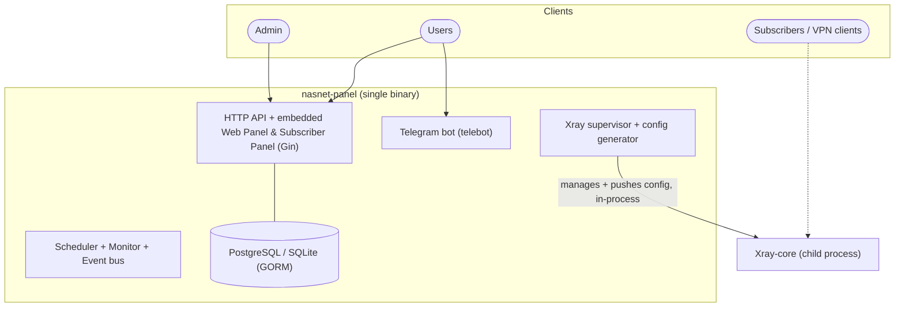
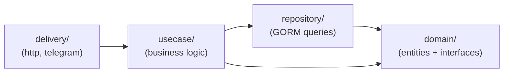

# Architecture

NasNet Panel is a **single Go binary** that runs everything: the HTTP API and embedded web UIs, the Telegram bot, background services, and supervision of a local **Xray-core** process. There is no separate agent and no fleet — the panel and the proxy core run on the same host.

## The binary

A single Go binary (entry point `main.go` → `cmd/root.go`, command `nasnet-panel serve`) that runs:

- **HTTP server** (Gin) — the REST API plus the embedded admin **web panel** and **subscriber panel** (a `go:embed`ed Vite build of `web-panel/dist`).
- **Telegram bot** (optional) — admin operations and user-facing subscription info.
- **Xray supervisor** — starts Xray-core as a child process, keeps it alive with a watchdog, and applies generated configuration to it.
- **Background services** — a scheduler, a monitor, provisioning worker, alert engine, and notification dispatcher.
- **Database** — PostgreSQL or SQLite via GORM, with automatic schema migration on boot.

## Xray control plane (in-process)

The panel does not talk to Xray-core over a network gRPC hub. Configuration you build in the panel (inbounds, outbounds, routing, balancing) is compiled into an Xray config by the config generator, and the supervisor applies it to the local core and reloads it. The panel reads stats and manages proxy users through Xray's local gRPC API (default `127.0.0.1:10085`).

The request/response shapes exchanged with the core are defined in `proto/node_agent.proto` and used as **in-process DTOs** — there is no wire transport and no mutual TLS between the panel and the core.

## Layered (clean) architecture

Each feature under `internal/<feature>/` follows the same four layers, which keeps business logic independent of transport and storage and makes the code easy to test and navigate:

| Layer | Responsibility |
|-------|----------------|
| `domain` | Entities (GORM models) and the repository/usecase **interfaces**. No framework imports. |
| `repository` | Data access — implements the domain repository interfaces against GORM. |
| `usecase` | Business logic — orchestrates repositories, enforces rules, emits events. |
| `delivery` | Transport adapters — `http` (Gin handlers) and `telegram` (bot handlers) that call usecases. |

Cross-cutting, reusable libraries live in `pkg/` (JWT, ACME, metrics, scheduler, events, cache, geoip, geofiles, i18n, WireGuard keys, Xray helpers, …). HTTP and Telegram wiring lives in `transport/`.

### Dependency wiring

All repositories and usecases are constructed once at startup in `cmd/bootstrap.go` (`initRepositories` → `initUsecases`) and injected into the HTTP server and Telegram bot. Where two usecases genuinely depend on each other, the cycle is broken with setter injection after construction.

## Eventing & background work

- **Event bus** (`pkg/events`) — usecases publish domain events (subscription created, subscription expired, Xray down/recovered, …). Subscribers include the metrics collector, the alert engine, and the notification dispatcher.
- **Scheduler** (`pkg/scheduler`) — periodic jobs: subscription expiry, usage aggregation, certificate renewal, retention cleanup, digests, and notifications.
- **Monitor** — polls Xray and host health and raises events when state changes.
- **Provisioning worker** — runs asynchronous account add/remove work against the local core from a queue.
- **Alert engine** (`internal/alerting`) — evaluates rules against events and emits `SystemAlert` events, which the dispatcher routes to Telegram / Discord / webhooks.

## Persistence & migrations

GORM models from every feature are registered and **auto-migrated** on startup. The boot sequence also runs idempotent data backfills (subscription link keys, index reshaping, etc.), so upgrading is generally a matter of deploying the new binary and restarting. PostgreSQL gets a few GIN indexes that SQLite does not support.

## Request lifecycle (example)

A subscriber fetching their config:

1. The client requests `/sub/{link_key}`.
2. The HTTP layer resolves the subscription, checks expiry/traffic, and detects the client app from the `User-Agent`.
3. The subscription usecase asks the Xray product provider to build the per-client config/links from the subscription's inbounds and the server's host data.
4. The response is returned as a base64 feed with usage metadata headers. See [Subscriptions & Clients](./subscriptions-and-clients.md).

## Where to look in the code

| Path | What's there |
|------|--------------|
| `main.go`, `cmd/` | Entry point, `serve` command, bootstrap wiring, helper commands (`add_xray_user`, `nasnet-tool`) |
| `internal/<feature>/` | Feature modules (node/server, subscription, account, user, admin, alerting, audit, chat, notification, wireguard, xray, sni, maintenance, monitor, provisioning, …) |
| `internal/agent/` | Local Xray supervision: process manager, stats, traffic, access logs, SSH, terminal |
| `pkg/` | Reusable libraries |
| `transport/http`, `transport/telegram` | Server and bot routing |
| `pkg/agent`, `proto/node_agent.proto` | In-process Xray control interface and DTOs |
| `web-panel/` | Admin + subscriber panel SPA — `go:embed`ded into the binary |

For build instructions and the full directory map, see the [Development guide](./development.md).
