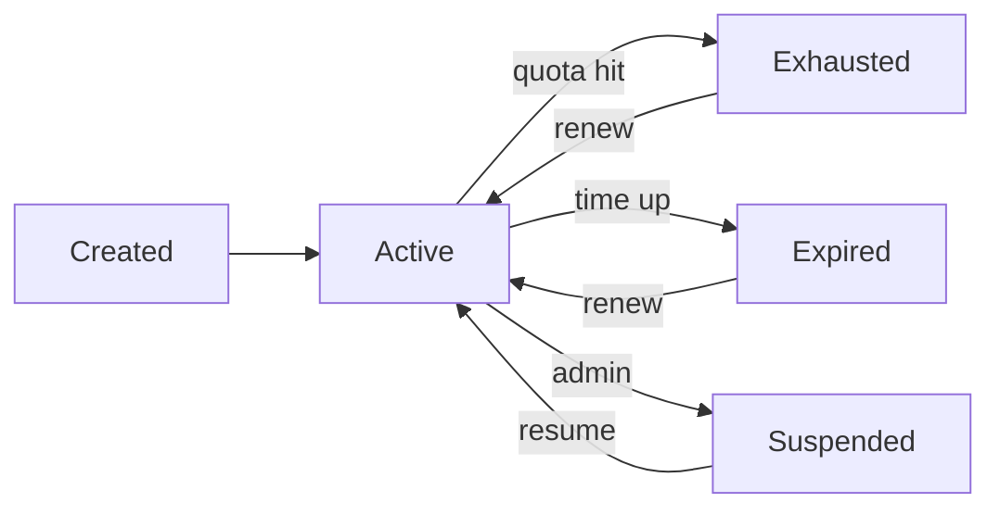

# Subscriptions & Clients

A **subscription** is a user's active entitlement: it has an expiry, a traffic quota, and a unique subscription link that VPN client apps poll for configuration.

## The subscription link

Each subscription has a random **link key** (a UUID, distinct from any proxy credential) and is served at:

```
{APP_BASE_URL}/sub/{link_key}
```

The link key is deliberately separate from the underlying proxy UUID so the public URL never leaks a credential. (Older subscriptions are migrated to fresh link keys automatically.)

### What the endpoint returns

When a VPN client fetches the link, the server returns a **Base64-encoded list of connection links** — the standard subscription format that Xray/V2Ray-family clients understand. It also sets metadata headers clients use to display quota and a profile name:

- **`subscription-userinfo`** — upload/download/total/expiry counters, so the client can show data usage and time left.
- **`profile-title`** — a display name for the profile (base64-encoded).

If a **browser** opens the link (rather than a client app), and `SUB_PANEL_URL` is configured, the request is redirected to a user-facing subscription page instead of returning raw config.

## Client auto-detection

The server inspects the `User-Agent` of the request and tailors the response to the detected client. Recognized clients include:

- **v2rayNG** / **v2rayN**
- **Clash** (and Clash-family clients)
- **sing-box**
- **Shadowrocket**

This means one link works across the popular clients without the user picking a format manually.

## QR codes

The panel and Telegram bot can render a subscription (or an individual config) as a **QR code**, so users can import it by scanning instead of copy-pasting a long link.

## Usage tracking & limits

- **Traffic** — usage is aggregated per subscription (and split into upload/download). When a subscription hits its data limit it is exhausted and access stops until renewed.
- **Daily usage** — per-day usage is recorded for charts and trend analysis.
- **Expiry** — the scheduler checks subscriptions and disables them when they expire; users can be notified before expiry.
- **Device / IP limits** — the server tracks the source IPs seen per subscription (`subscription_ips`), which supports limiting how many simultaneous devices/IPs a subscription may use. This is useful to discourage account sharing.

## Lifecycle



When a subscription changes state, the server reconciles the underlying proxy accounts in the local Xray process (and WireGuard peers, if any) so access matches the subscription's status.

## For end users

A typical user journey:

1. Get a subscription (created by an admin, or via the Telegram bot).
2. Copy the subscription link or scan its QR code.
3. Paste it into their client app (v2rayNG, sing-box, Clash, Shadowrocket, …) as a subscription.
4. The client pulls all available servers and shows remaining data and time.
5. The client refreshes the subscription periodically to pick up server changes.
